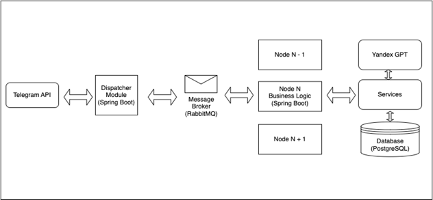
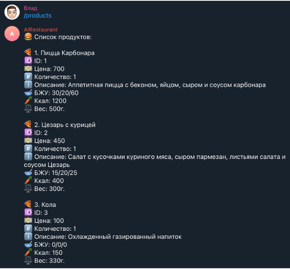
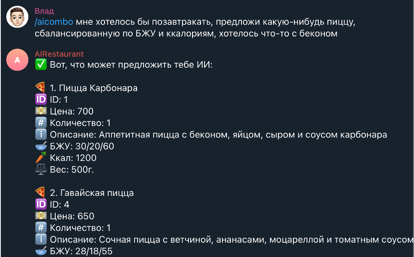
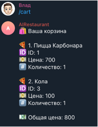
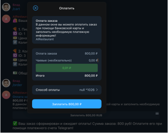
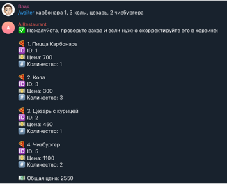
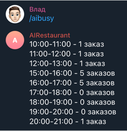
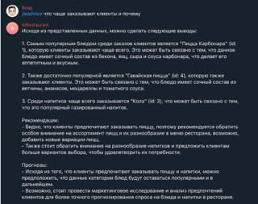

## Система для автоматизации бизнес-процессов заведений общественного питания с использованием искусственного интеллекта

### Описание приложения
Масштабируемое приложение представлено в виде Telegram бота с серверной частью, также есть открытое API, с которым может
взаимодействовать Frontend. Система помогает унифицировать, автоматизировать и упростить бизнес-процессы внутри
компании. Клиенты смогут быстро и удобно оформлять заказы при помощи своего устройства с получением рекомендаций AI,
персонал заведений – принимать их и готовить к выдаче, а также вести учет времени на выполнение заказов, прогнозировать загруженность ресторана в разные промежутки времени и получать рекомендации при помощи искусственного интеллекта.

### Технологический стек
В качестве основного технологического стека были выбраны следующие технологии:
- фреймворк **Spring Boot**
- база данных **PostgreSQL**
- брокер сообщений **RabbitMQ**
- библиотека для работы с мессенджером **Telegram Bots**
- языковая модель для запросов к искусственному интеллекту **YandexGPT**

### Архитектура приложения

1. Сначала клиент отправляет сообщение Telegram боту
2. Мессенджер через API интерфейс присылает сообщение **сервису-обработчику**
3. Обработчик кладет его в **очередь брокера RabbitMQ**
4. Сообщение высылается одному из запущенных экземпляров бизнес-логики, если их будет несколько – обработка запросов от брокера будет происходить **параллельно**, что обеспечит нам **масштабируемость при увеличении нагрузки**
5. Модуль бизнес-логики принимает сообщение, проводит его анализ и направляет на нужный сервис. Сервисы обрабатывают сообщение, отправляют запросы к **искусственному интеллекту**, производят необходимые манипуляции в базе данных, формируют ответ и направляют его в очередь брокера
6. Брокер принимает сообщение и отправляет его **сервису-обработчику**
7. Обработчик отправляет его через API на **сервер Telegram**
8. Мессенджер принимает сообщение и отправляет ответ пользователю

### Пример работы приложения
#### Получение ассортимента товаров заведений

#### Получение предложений от искусственного интеллекта

#### Пример добавления товаров корзину

#### Оплата заказа клиентом

#### Управление статусами заказов

#### Оформление заказа официантом

#### Прогнозирование загруженности ресторана

#### Маркетинговые советы по заказам клиентов
